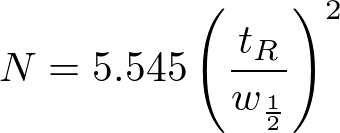

# クロマトグラフィー

## クロマトグラフィーとは

>クロマトグラフィーは混合試料を成分ごとに分離する技術です。

[第1回 HPLCの原理とシステム構成（1）](https://www.hitachi-hightech.com/hhs/products/tech/ana/lc/basic/lc_course1.html)

20世紀初頭、ミハイル・ツヴェットが発明した。

## 固定相・移動相と名称

||移動相|固定相|分析法の名称|
|:--:|:----:|:---:|:---:|
|ガスクロマトグラフィー（GC）|気体|液体|気-液(分配)クロマトグラフィー|
|||固体|気-個(吸着)クロマトグラフィー|
|液体クロマトグラフィー（LC）|液体|液体|液-液(分配)クロマトグラフィー|
|||固体|液-個(吸着)クロマトグラフィー|

## 固定相への保持機構による分類

|固定相への保持機構|固定相|名称|
|:-:|:-:|:-:|
|吸着|シリカゲル、アルミナ、活性炭、珪藻土など|吸着クロマトグラフィー|
|イオン交換|イオン交換体|イオン交換クロマトグラフィー|
|溶解|液体|分配クロマトグラフィー|
|孔内保持|多孔性ゲル|サイズ排除クロマトグラフィー|

[吸着クロマトグラフィー(きゅうちゃくくろまとぐらふぃー)とは - コトバンク](https://kotobank.jp/word/%E5%90%B8%E7%9D%80%E3%82%AF%E3%83%AD%E3%83%9E%E3%83%88%E3%82%B0%E3%83%A9%E3%83%95%E3%82%A3%E3%83%BC-1300394)

[イオン交換クロマトグラフィー - 薬学用語解説 - 日本薬学会](https://www.pharm.or.jp/dictionary/wiki.cgi?%E3%82%A4%E3%82%AA%E3%83%B3%E4%BA%A4%E6%8F%9B%E3%82%AF%E3%83%AD%E3%83%9E%E3%83%88%E3%82%B0%E3%83%A9%E3%83%95%E3%82%A3%E3%83%BC)

[クロマトグラフィー - Wikipedia](https://ja.wikipedia.org/wiki/%E3%82%AF%E3%83%AD%E3%83%9E%E3%83%88%E3%82%B0%E3%83%A9%E3%83%95%E3%82%A3%E3%83%BC)

[サイズ排除クロマトグラフィー｜研究用語辞典｜研究.net](http://www.kenq.net/dic/38.html)

## 液体クロマトグラフィーの分離場と名称

|分離場|名称|
|:-:|:-:|
|ガラス板やプラスチック板の上に固定相を塗布したもの|薄層クロマトグラフィー|
|ろ紙|ペーパークロマトグラフィー|
|カラム|カラムクロマトグラフィー|

## 分配クロマトグラフィー

|固定相|移動相|分析法の名称|
|:--:|:----:|:---:|
|極性の高い液相|極性の低い液相|順相クロマトグラフィー|
|極性の低い液相|極性の高い液相|逆相クロマトグラフィー|

## ガスクロマトグラフィー（GC）

### GC（ガスクロマトグラフ）とは？

>GCは，気体の分析手法であるガスクロマトグラフィーを行う装置（ガスクロマトグラフ：Gas Chromatograph）の略称です。
>GCの分析対象は，気体および液体(試料気化室の熱で気化する成分) です。化合物が混合された試料をGCで分析すると，各化合物ごとに分離，定量することができます。

[GC（ガスクロマトグラフ）とは？](https://www.an.shimadzu.co.jp/gc/support/faq/fundamentals/gas_chromatography.htm)

### GCの装置構成

>「液体試料を加熱し，気化するための試料気化室」・「各化合物に分離するためのカラム」・「各化合物を検出し，その濃度を電気信号として出力する検出器」の3点がGCの主な構成品です。

[GC（ガスクロマトグラフ）とは？](https://www.an.shimadzu.co.jp/gc/support/faq/fundamentals/gas_chromatography.htm)

### GCの検出器

* 水素炎イオン化検出器（FID）

* 熱伝導度検出器（TCD）

* バリア放電イオン化検出器（BID）

[検出器　GC分析の基礎 : 株式会社島津製作所](https://www.an.shimadzu.co.jp/gc/support/faq/fundamentals/detector.htm)

## 液体クロマトグラフィー（LC）

### LCの検出器

* UV/Vis（紫外可視分光）検出器

* 蛍光検出器

* RI（示差屈折）検出器

## 理論段数

tR:保持時間

w1/2:ピークの半値幅

## 理論段高さ HETP

L:カラムの長さ

N:理論段数

---

u:線速度として

と表せる。

## 分離度 Rsと分離係数 α

tRA,tRBは保持時間

WA,WBはピーク幅

[HPLC //LCtalk81号入門　「分離度のはなし　その1」 : 株式会社島津製作所](https://www.an.shimadzu.co.jp/hplc/support/lib/lctalk/81/81intro.htm)

保持係数kは、

t0:非保持物質のカラム通過時間

tR:保持時間

を用い

であり、分離係数αはkを用いて

とあらわされる。

α=1の時、ピークが完全に重なる

α>1で分離可能

α>2が理想

[基本に戻りましょう第一回:保持係数](https://blog.sepscience.com/japan/%E5%9F%BA%E6%9C%AC%E3%81%AB%E6%88%BB%E3%82%8A%E3%81%BE%E3%81%97%E3%82%87%E3%81%86%E7%AC%AC%E4%B8%80%E5%9B%9E%E4%BF%9D%E6%8C%81%E4%BF%82%E6%95%B0)
